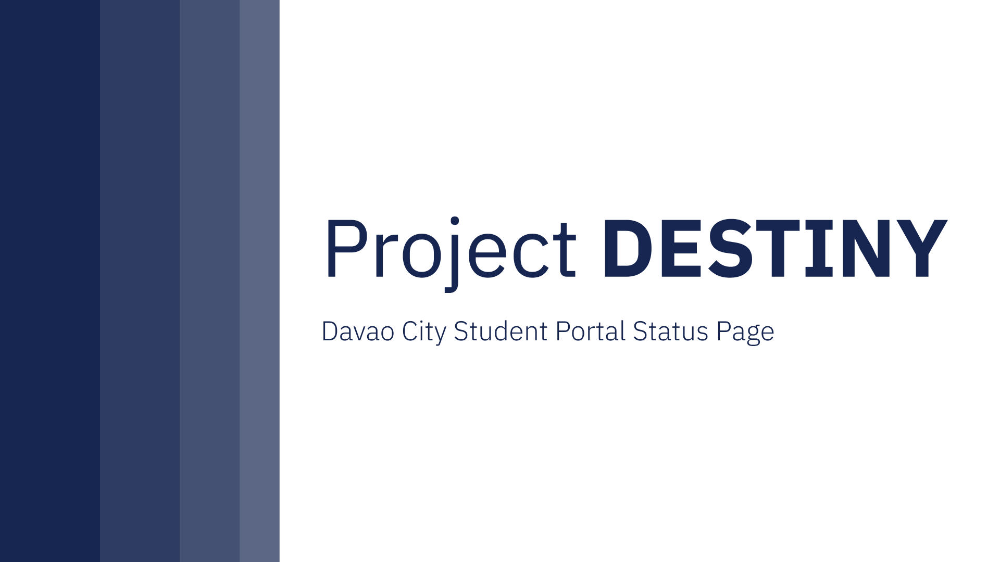

# Project DESTINY

  
<div align="center">
An Uptime Status checker for various student portals and school websites across Davao City

  

Davao Educational Sites Tracker Identifying Network Yield

  



  

[](CONTRIBUTING.md)
[](https://opensource.org/)
[](https://thirdpartyservice.com/)
[](https://github.com/jeoooo)
[](https://www.behance.net/gallery/189152357/PROJECT-DESTINY)
</div>
  

# Description

  

Project DESTINY  is an unofficial, open-source Uptime Status Checker dedicated to monitoring the availability of key websites and student portals across Davao City.

  

This project is written in [Svelte](https://developer.mozilla.org/en-US/docs/Learn/Tools_and_testing/Client-side_JavaScript_frameworks/Svelte_getting_started) and uses [SvelteKit](https://joyofcode.xyz/what-is-sveltekit) as its meta-framework. It conducts routine checks by leveraging [proxy servers](https://www.fortinet.com/resources/cyberglossary/proxy-server#:~:text=A%20proxy%20server%20is%20a,web%20pages%20they%20visit%20online.) to check the uptime of the websites. The backend of this project uses [Pocketbase](https://pocketbase.io/).


# Features:

  

- Real-time Monitoring: Regular checks ensure up-to-the-minute status updates.

- User-Friendly Interface: Easily check website status with an simplistic design.

- Open-Source: Contribute to the project and enhance its functionality.

  
  

# Prerequisites

  

- [Node.js](https://nodejs.org/en)
- Node Package Manager (NPM)
- [Pocketbase](https://pocketbase.io/) (v20.0.0+)

  

# Table of Contents
- [Installation](#installation)
- [Contributing](#contributing)


# Installation

```bash

git clone https://github.com/jeoooo/PROJECTDESTINY.git

cd PROJECTDESTINY

npm install

npm run dev

```

1. Execute pocketbase.exe from the root folder.

2. Run the pocketbase instance using the following command

```bash

./pocketbase serve

```

this will open a pocketbase instance at http://127.0.0.1:8090 just like the example below

```bash

2023/12/31 06:47:32 Server started at http://127.0.0.1:8090

├─ REST API: http://127.0.0.1:8090/api/

└─ Admin UI: http://127.0.0.1:8090/_/

```

# Additional Resources

Wanna contribute? Here are the following resources you can use when working on the HCDC True Site codebase:


- Svelte Documentation: [https://svelte.dev/docs/introduction](https://svelte.dev/docs/introduction)
- SvelteKit Documentation: [https://kit.svelte.dev/docs/introduction](https://kit.svelte.dev/docs/introduction)
- Typescript Handbook: [https://www.typescriptlang.org/docs/handbook/intro.html](https://www.typescriptlang.org/docs/handbook/intro.html)
- TailwindCSS Docs (For additional information): [https://tailwindcss.com](https://tailwindcss.com/)
- MDN Web Docs (For additional information): [https://developer.mozilla.org/en-US/](https://developer.mozilla.org/en-US/)
- Pocketbase Documentation: [https://pocketbase.io/docs/](https://pocketbase.io/docs/)

# Contributing

1. Fork it ([https://github.com/jeoooo/hcdctruesite/fork](https://github.com/jeoooo/hcdctruesite/fork))
2. Create your feature branch (`git checkout -b my-new-feature`)
3. Commit your changes (`git commit -am 'Add some feature'`)
4. Push to the branch (`git push origin my-new-feature`)
5. Create a new Pull Request

> [!IMPORTANT]
> To contribute or suggest schools you may submit [a GitHub Issue](https://github.com/jeoooo/PROJECTDESTINY/issues)

# License
[MIT license](https://github.com/jeoooo/PROJECTDESTINY/blob/main/LICENSE)
